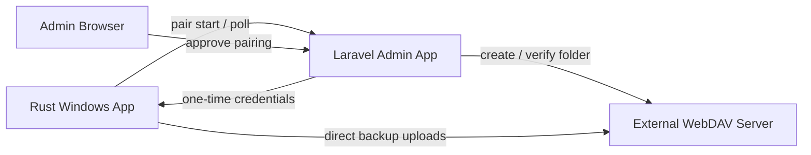
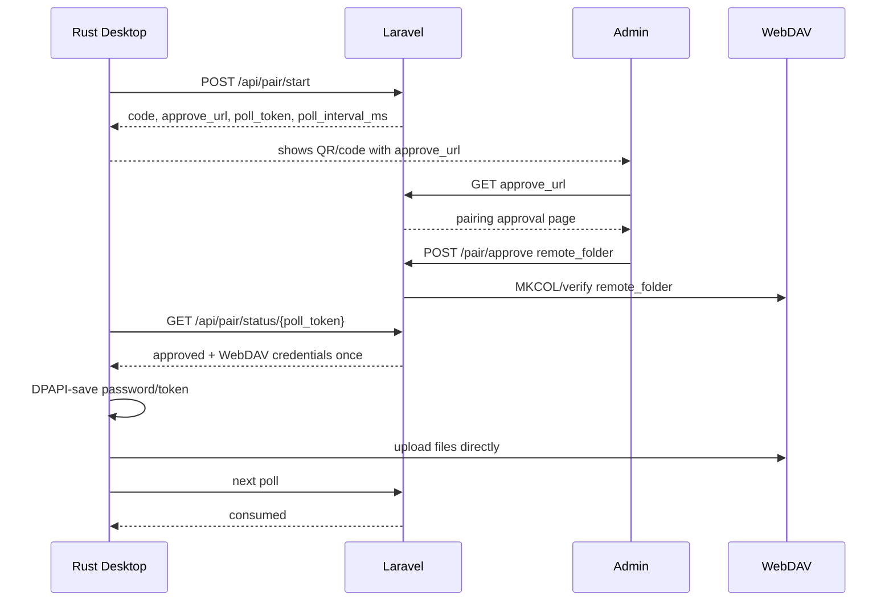

# Backup Sync Communication Spec

This is the shared contract between the Windows desktop backup app and the Laravel admin app.

## Goal

The desktop app must upload backup files directly to WebDAV without requiring the customer/user to type the WebDAV URL, username, or password.

Laravel is only the credential/control plane:

- create a one-time pairing request
- let an authenticated admin approve the target WebDAV customer folder
- return WebDAV credentials once to the polling desktop app
- never proxy backup file uploads

## System Map



## Pairing Flow



## API Endpoints

### `POST /api/pair/start`

Creates one pending pairing request.

Request:

```json
{
  "machine_name": "RECEPTION-PC",
  "windows_user": "office",
  "app_version": "2026.0.3",
  "detected_folder": "XDPT.59655-Palmeira-Minimercado"
}
```

Rules:

- `machine_name` is required.
- `windows_user`, `app_version`, and `detected_folder` are optional strings.
- `detected_folder` is only a hint from local XD detection.
- Laravel must not trust `detected_folder` as the approved customer folder.
- The editable desktop destination field must not be sent unless it came from XD detection.

Response:

```json
{
  "code": "ABCD-EFGH",
  "approve_url": "https://box.rui.cam/pair?code=ABCD-EFGH",
  "poll_token": "uuid-token",
  "poll_interval_ms": 3000
}
```

### `GET /api/pair/status/{poll_token}`

Polls the pairing request. `poll_token` is the request UUID and is a one-time capability token.

Pending response:

```json
{ "status": "pending" }
```

Rejected response:

```json
{ "status": "rejected" }
```

Expired response:

```json
{ "status": "expired" }
```

Approved response, returned once:

```json
{
  "status": "approved",
  "device_token": "raw-random-token-returned-once",
  "webdav_url": "https://u561272-sub1.your-storagebox.de",
  "username": "u561272-sub1",
  "password": "raw-webdav-password-returned-once",
  "remote_folder": "XDPT.59655-Palmeira-Minimercado"
}
```

After approved payload consumption:

```json
{ "status": "consumed" }
```

Failure response if the approved payload is unexpectedly missing:

```json
{ "status": "failed" }
```

## Status Values

Use these exact status strings everywhere:

| Status | Meaning |
| --- | --- |
| `pending` | Waiting for admin approval/rejection |
| `approved` | Credentials are included in this response; returned once |
| `rejected` | Admin rejected the request |
| `expired` | Request timed out before approval |
| `consumed` | Approved payload was already collected |
| `failed` | Request was approved but payload is missing |

Do not use `denied`.

## Folder Rules

Laravel owns `remote_folder`.

Valid `remote_folder`:

- one path segment only
- non-empty after trim
- not `/` or `\`
- no `/`
- no `\`
- no `..`
- no ASCII control characters

Rust must reject approved pairing if `remote_folder` is missing or invalid.

Desktop upload URL:

```text
webdav_url / remote_folder / relative_file_path
```

Example:

```text
webdav_url:     https://u561272-sub1.your-storagebox.de
remote_folder: XDPT.59655-Palmeira-Minimercado
relative path: 2026/backup.zip
upload URL:    https://u561272-sub1.your-storagebox.de/XDPT.59655-Palmeira-Minimercado/2026/backup.zip
```

## Credential Handling

Laravel:

- stores the approved payload encrypted at rest
- returns raw WebDAV credentials only once over HTTPS
- clears the approved payload immediately after the first successful status poll
- stores only `hash('sha256', device_token)` for devices

Rust:

- receives raw WebDAV credentials only from the approved poll response
- stores WebDAV password with Windows DPAPI
- stores device token with Windows DPAPI
- treats `device_token_enc` presence as paired state
- locks server URL, username, password, and `remote_folder` after pairing

## WebDAV Uploads

Laravel never proxies uploads.

Rust uploads directly to WebDAV with Basic Auth:

```text
Authorization: Basic base64(username:password)
PUT {webdav_url}/{remote_folder}/{relative_file_path}
```

Rust may create remote folders with `MKCOL` as needed below the approved `remote_folder`.

## Credential Failure

Keep this simple:

- if WebDAV credentials fail with `401` or `403`, Rust should stop automatic upload attempts
- Rust should tell the user/admin to pair again
- no credential refresh API is part of this simplified spec

Re-pairing is the supported credential replacement path.

## Out Of Scope

- Laravel file upload proxying
- background desktop heartbeat
- credential refresh workflow
- per-customer WebDAV subaccounts
- SSE/WebSocket credential delivery
- client-side custom encryption on top of HTTPS

