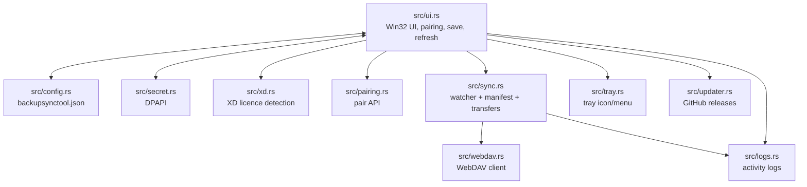
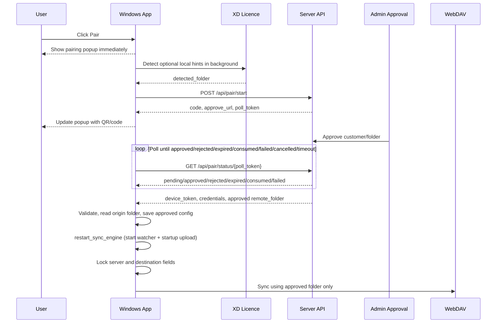

# Backup Sync Tool

Backup Sync Tool is a native Windows tray app that syncs one local backup folder to a WebDAV destination.

This README is the single project spec and handoff document. Keep current behavior here instead of adding separate feature/spec markdown files. `AGENTS.md` is reserved for agent/build instructions.

## Current Stack

- Rust 2021
- Raw Win32 UI through `windows-rs`
- Blocking HTTP/WebDAV through `ureq`
- Filesystem watching through `notify`
- JSON config through `serde` / `serde_json`
- Windows DPAPI for local secret encryption

Non-negotiables:

- No egui, nwg, webview, Electron, or async runtime.
- Config lives next to `backupsynctool.exe` as `backupsynctool.json`.
- The app must be launched from the repo root during local testing so it reads the root config.
- Closing the window hides it to tray; tray double-click reopens it.
- After code changes, build release, copy the exe to repo root, and relaunch from repo root.

## Features

- Native Windows tray app.
- Watches one local folder recursively.
- Local folder row includes quick actions to choose the folder and open it in Windows Explorer.
- Uploads new and changed files to WebDAV.
- **First-run baseline:** with no local manifest and **Download from server** off, startup uploads every file in the origin folder.
- Streams uploads from disk.
- Bounded parallel uploads with `parallel_uploads`.
- Sync engine starts on app launch (when configured), **immediately after pairing**, and when settings change (browse folder, checkboxes).
- Optional remote-to-local sync polling.
- Local and remote manifest tracking with `.backupsynctool-manifest.json` (local = last successful upload; remote = server snapshot from `PROPFIND`).
- Pairing flow with server-approved customer folder.
- Destination folder lock after pairing.
- WebDAV auth failure pauses sync and asks the user/admin to pair again.
- DPAPI protection for device token and WebDAV password.
- Start with Windows support.
- Recent Activity feed with inline per-file progress rows.
- Quiet status strip, footer batch progress bar, and detailed tray tooltip while syncing.
- Silent GitHub release check on startup.

## Main window UI

Target layout reference: **`mockups.html`**.

Paired window highlights:

- Quiet status strip (left accent + dot + text) inset from the window edges with top padding (matches `mockups.html` `.body` / `.quiet-status` spacing). Shows **connection only** (**Connected** / **Offline** / **Not paired**; amber/red for errors such as reconnect required). Sync state (**All synced**, **Checking…**, **Syncing**, file progress `done/total · pct%`, upload failures) lives in the **sync footer** above the checkboxes — not duplicated in the strip. Failed uploads also appear as red rows at the top of Recent Activity; **Retry failed** appears in the sync footer when paths are known.
- **Connect** / **Reconnect** button on the server row (grey, same style as Open/Browse); **Open** then **Browse** on the backup folder row.
- Labels: “Backup folder on this PC”, “Server destination”, “Sync from server”.
- **Server destination** is a read-only path panel (soft grey fill, light border) — not an editable field; only the backup folder row uses a real edit control.
- **No Save button** — settings auto-save on browse + checkbox changes (`persist_settings` in `src/ui/commands.rs`).
- Footer batch progress: `msctls_progress32` + `done/total · pct%` (+ ETA when syncing).
- Recent activity: owner-draw list with inline mini bars (indeterminate while uploading; stepped 0–100% from sync logs). Failed uploads appear at the top in red with the error detail; **Retry failed** in the sync footer re-queues those paths.

## Project Layout

| Path | Purpose |
| --- | --- |
| `src/main.rs` | Entry point, module wiring, window/message loop startup |
| `src/ui.rs` | Main Win32 UI, pairing UX, config locking, event handlers |
| `src/ui/activity.rs` | Owner-draw Recent Activity list and row model |
| `src/config.rs` | Load/save `backupsynctool.json` next to the exe |
| `src/secret.rs` | DPAPI encrypt/decrypt helpers |
| `src/webdav.rs` | Blocking WebDAV HTTP client |
| `src/sync.rs` | File watcher, manifest logic, upload/download sync engine |
| `src/tray.rs` | System tray icon and context menu |
| `src/updater.rs` | GitHub release check, download, swap, restart |
| `src/pairing.rs` | Pair start/status API client |
| `src/xd.rs` | XD local folder/licence detection |
| `src/logs.rs` | Local log file append/open support |
| `build.rs` | Embeds icons and manifest into the exe |
| `assets/` | App, tray, update, and sync icons |

## Architecture



## Configuration

Example `backupsynctool.json`:

```json
{
  "watch_folder": "C:\\XDSoftware\\backups",
  "webdav_url": "https://example.com/webdav/XD-BACKUPS",
  "username": "user",
  "password_enc": "...",
  "remote_folder": "XDPT.59655-Palmeira-Minimercado",
  "pair_api_base": "https://box.rui.cam",
  "device_token_enc": "...",
  "credential_profile_id": 10,
  "credential_version": 1,
  "start_with_windows": true,
  "sync_remote_changes": false,
  "parallel_uploads": 10
}
```

Important fields:

| Field | Meaning |
| --- | --- |
| `watch_folder` | Local folder watched recursively |
| `webdav_url` | Server/WebDAV root URL |
| `username` | WebDAV username |
| `password_enc` | DPAPI-encrypted WebDAV password |
| `remote_folder` | Approved server-owned customer folder after pairing |
| `pair_api_base` | Pairing/credential API base, default `https://box.rui.cam` |
| `device_token_enc` | DPAPI-encrypted device token; presence means paired |
| `credential_profile_id` | Optional server credential profile id |
| `credential_version` | Optional server credential version |
| `start_with_windows` | Defaults to `true` |
| `sync_remote_changes` | **Download from server** — enables remote polling and download-on-startup; when off, app is upload-primary |
| `parallel_uploads` | Upload worker count, defaults to `10` |

Secrets must never be written as plaintext.

## XD Detection

XD detection is optional. If XD is not present, pairing still works and the server/admin chooses the customer.

Relevant local paths:

```text
C:\XDSoftware\backups
C:\XDSoftware\cfg\xd.lic
C:\XDSoftware\cfg\xd.pem
```

Current app behavior:

- `src/xd.rs` performs native Rust detection; it does not use PowerShell or XD DLL reflection.
- It reads `C:\XDSoftware\cfg\xd.lic` as JSON.
- It reads `C:\XDSoftware\cfg\xd.pem` as the RSA public key.
- It decrypts the `Number` and `ClientComercialName` fields with the same raw RSA block algorithm used by the diagnostic `license-inspector.exe --remote-folder` helper.
- It builds the detected folder as `Number` + `-` + slugified commercial name.

Detected values:

| Rust helper | Source | Example |
| --- | --- | --- |
| `default_watch_folder()` | Existing `C:\XDSoftware\backups` directory | `C:\XDSoftware\backups` |
| `detect_customer_hint().customer` | Decrypted `ClientComercialName` | `Palmeira Minimercado` |
| `detect_customer_hint().folder` | Decrypted `Number` + slugified decrypted `ClientComercialName` | `XDPT.59655-Palmeira-Minimercado` |

Before pairing, the app may prefill an empty destination field from XD detection. That value is only a hint. Pairing must not trust the editable destination textbox.

## Pairing And Folder Lock

Pairing lets the server approve the final customer folder and return credentials.



Pair start request:

```json
{
  "machine_name": "RECEPTION-PC",
  "windows_user": "office",
  "app_version": "2026.0.3",
  "detected_folder": "XDPT.59655-Palmeira-Minimercado"
}
```

Rules:

- `detected_folder` is a hint only.
- It comes from XD licence detection in `src/xd.rs`.
- It must not come from the editable destination textbox.
- If XD detection fails, the field is omitted.
- The approved `remote_folder` must come back from the server.
- Pair polling handles exact terminal statuses: `approved`, `rejected`, `expired`, `consumed`, and `failed`.

Approved response shape:

```json
{
  "status": "approved",
  "device_token": "...",
  "webdav_url": "https://example.com/webdav/XD-BACKUPS",
  "username": "...",
  "password": "...",
  "remote_folder": "XDPT.59655-Palmeira-Minimercado",
  "credential_profile_id": 10,
  "credential_version": 1
}
```

The app rejects approved pairing if:

- `device_token` is missing or empty.
- `webdav_url` is missing or does not start with `https://`.
- `username` is missing or empty.
- `password` is missing or empty.
- `remote_folder` is missing.
- `remote_folder` is empty.
- `remote_folder` is `/` or `\`.
- `remote_folder` starts with `/` or `\`.
- `remote_folder` contains `/` or `\`.
- `remote_folder` contains `..`.
- `remote_folder` contains ASCII control characters.

Once paired:

- `device_token_enc` is present.
- The sync engine starts immediately via `restart_sync_engine()` in `src/ui/utils.rs` (no Save click required).
- Server URL, username, password, and destination folder become read-only.
- Destination browse is hidden/disabled.
- `persist_settings` preserves the stored approved folder even if UI text changes.
- Background XD detection cannot overwrite the approved folder.
- Remote picker navigation cannot change the approved folder.

The only supported way to change customer folder is to re-pair through the server.

## Sync Behavior

### When the engine starts

`restart_sync_engine()` in `src/ui/utils.rs` starts (or restarts) the sync engine when **all** of these are set: origin folder (`watch_folder`), WebDAV URL, username, password, and approved destination folder (`remote_folder`).

It is called from:

| Trigger | Location |
| --- | --- |
| App launch (config already complete) | `src/ui/create.rs` `on_create` |
| Successful pairing | `src/ui/messages.rs` `on_app_pair_result` |
| Browse folder accepted | `src/ui/commands.rs` `browse_local` → `persist_settings` |
| **Start with Windows** or **Sync from server** toggled | `src/ui/commands.rs` `persist_settings_on_toggle` |

If the origin folder is empty at pair/save time, `ensure_default_watch_folder()` uses `xd::default_watch_folder()` (`C:\XDSoftware\backups` when that directory exists).

Pairing alone must never stop at “saved config” without starting the engine — that was a prior bug; the spec requires an immediate start after approval.

### Watcher and startup

The sync engine watches `watch_folder` recursively using `notify`.

Startup flow (`sync_startup` in `src/sync.rs`):

1. Load local manifest from `.backupsynctool-manifest.json` next to the origin folder (empty if missing).
2. Log `Startup scan of {watch_folder}: N file(s)`.
3. Branch on whether a local manifest file existed on disk (`had_local_manifest`).

| Local manifest file | Download from server off (default) | Download from server on |
| --- | --- | --- |
| **Missing** | Upload **every** local file (first backup baseline). Log: `No local manifest, using local files as baseline`. | If remote manifest has entries, **download** server files as baseline instead of uploading. |
| **Present** | `PROPFIND` lists the approved folder; upload if local changed since last success, or file missing/wrong size on server. | Same upload rules; also download when remote manifest differs. |

Ongoing behavior:

- Local manifest entries are updated **only after a successful PUT** (`upload_path` returns true).
- The remote manifest JSON is **not** proof a file exists on the server; upload skip when a local manifest exists requires **both** unchanged local state **and** a matching entry from `PROPFIND` (or listing unavailable with no remote baseline).
- Remote manifest JSON is rewritten from a fresh `PROPFIND` listing after upload batches (`save_remote_manifest_from_server`), not from a full local directory scan.
- Local creates/modifies are queued and uploaded after a short debounce.
- Uploads are bounded by `parallel_uploads`.
- Every 24 hours, `heal_missing_uploads` re-uploads local files missing or size-mismatched on the server (even when `sync_remote_changes` is off).
- Optional remote-to-local sync polls remote state every 60 seconds when `sync_remote_changes` is enabled.
- `.backupsynctool-manifest.json` is ignored by scanning and the file watcher.
- Sync footer **All synced** means idle with zero failed uploads in the last batch; failures show **N upload(s) failed** in the footer (top strip stays **Connected** when online).

### Manifest files

| File | Location | Meaning |
| --- | --- | --- |
| **Local** | `{watch_folder}/.backupsynctool-manifest.json` | Per-path `{ size, mtime }` after last **successful** upload |
| **Remote** | `{webdav_url}/{remote_folder}/.backupsynctool-manifest.json` | Optional server-side snapshot built from `PROPFIND`, not from local scan |

Do not treat either manifest alone as “everything is on the server.” Server truth for existence is `PROPFIND` / PUT success.

Remote URL construction:

```text
webdav_url / remote_folder / relative_file_path
```

Example:

```text
webdav_url:     https://example.com/webdav/XD-BACKUPS
remote_folder: XDPT.59655-Palmeira-Minimercado
relative path: 2026/backup.zip
upload URL:    https://example.com/webdav/XD-BACKUPS/XDPT.59655-Palmeira-Minimercado/2026/backup.zip
```

The sync engine must always use the stored approved `remote_folder` for paired devices.

## Credential Failure

Credential refresh is not part of the active desktop protocol.

On WebDAV **HTTP 401** only:

- `WebDavError::AuthFailed` is raised; automatic sync is paused and the engine is stopped.
- A local activity/log message says the credentials are invalid.
- The UI shows **Reconnect required** and asks the user/admin to reconnect (pair again).
- The app does not call `/api/device/credential-refresh/*`.

**HTTP 403** is **not** treated as invalid credentials (common on Storage Box `MKCOL` when a folder already exists). `MKCOL` treats 403 and 405 as success; non-auth folder-create errors are logged and upload still attempts `PUT`.

Re-pairing clears `auth_failure_notified` and restarts sync via `restart_sync_engine()`.

## UI Behavior

The UI is raw Win32. Controls are direct children of the main window; do not add panel child windows for owner-drawn controls.

Implemented behavior:

- Closing hides to tray.
- Tray double-click reopens.
- Tray menu can open app/logs or exit.
- Pair button opens the pairing popup immediately, then the background pairing worker adds the QR/code after `/api/pair/start` responds.
- While pairing is pending, the server status shows an amber dot, `Waiting for approval`, and the Pair button changes to `Waiting...`.
- The pairing QR window starts in a preparing state, then shows the approval code, expiry text, waiting-for-admin message, QR code, approval link, and a Cancel button.
- Pairing approval saves the returned device token, WebDAV credentials, and approved folder automatically, then **starts the sync engine immediately** (no extra Save click required). If the origin folder is empty, XD’s default backup path is used when available.
- Local settings (origin folder, startup preference, sync-from-server preference) auto-save on change and restart sync when applicable.
- Routine status and errors use the ribbon + Recent Activity (`notify_user`) and do **not** block the UI with message boxes. The only modal dialog is **Update Available** (Yes/No before downloading).
- UPDATE button is hidden until a newer GitHub release is found.
- Server credentials are not editable in the UI; `backupsynctool.json` is the source for stored WebDAV settings.
- Server status keeps the connected/paired/offline indicator; hovering it shows the configured server URL and approved destination folder.
- Destination folder is server-owned. Before pairing, the UI may show the XD-detected customer name/licence slug as a hint, but Laravel approval returns the final folder.
- Before approval the folder label is `Destination folder`; after approval it is `Approved folder`.
- Password field has show/hide behavior.
- Recent Activity displays compact sync/log messages such as `Uploading backup.zip`, `Uploaded backup.zip`, and `Downloaded backup.zip`.
- Sync progress is shown in the window and tray tooltip.
- The remote-to-local checkbox is labeled `Download from server` and maps to `sync_remote_changes`; this is a label-only wording choice and does not remove the existing behavior.
- After pairing, there is no success popup; ribbon shows **Paired • Checking…** then **Paired • Syncing…** while startup runs, and Recent Activity shows `Device paired. Uploading backup folder.`
- Credential failure, pair/save errors, and validation hints also go to ribbon + Recent Activity (no blocking dialogs).

Visible pairing states:

| State | Status text | Pair button | Folder label |
| --- | --- | --- | --- |
| Unpaired | `Not paired` / connection status | `Pair` | `Destination folder` |
| Pairing | `Waiting for approval` | `Waiting...` | `Destination folder` |
| Paired | `Paired` / `All synced` | `Pair` | `Approved folder` |
| Credential failure | `Reconnect required` | `Reconnect` | `Approved folder` |

Visual rules:

- Window background: `#F0F0F0`
- Card background: `#F8F8F8`
- Card border: `#DEDEDE`
- Labels: `#333333`, Segoe UI 12pt
- Section headers: `#888888`, Segoe UI 10pt SemiBold, all caps
- Blue action buttons: `#2B4FA3` with white text
- Grey buttons: `#E8E8E8` with `#333333` text

## Logs

Logs are always written (no toggle). They live next to the exe:

```text
logs/YYYY-MM-DD.log
```

Typical messages when diagnosing sync:

| Message | Meaning |
| --- | --- |
| `Sync engine started for {path}` | Engine running; watcher active |
| `Pairing complete; initial sync started.` | Pair succeeded and engine started |
| `Startup scan of {path}: N file(s)` | Local tree counted at startup |
| `No local manifest, using local files as baseline` | First-run upload-all path |
| `N file(s) to upload` | Startup batch queued |
| `Uploading:` / `Uploaded:` | Per-file progress |
| `N upload(s) failed` (ribbon) | Last batch had failures |

Tray menu and Recent Activity surface the same log stream via `src/logs.rs`.

## Auto Update And Release

On startup the app checks:

```text
https://api.github.com/repos/ruibeard/backup-sync-tool/releases/latest
```

If a newer version is available:

- UPDATE button appears.
- User-triggered update downloads the release exe.
- A batch swapper replaces the running exe and restarts the app.

Release flow:

1. For local build/test cycles, use `.\build-local.ps1`.
2. For an actual public release, prefer `.\release.ps1`.
3. `release.ps1` bumps the patch version in `Cargo.toml`, builds release, copies `target\release\backupsynctool.exe` to repo-root `backupsynctool.exe`, commits, creates a new `vX.Y.Z` tag, pushes `main`, pushes the tag, and verifies the remote tag exists.
4. Do not move or force-push an existing release tag during normal releases. Only use `git tag -f` / `git push --force` when explicitly repairing a bad tag or bad release.

## Build

From repo root:

```powershell
Stop-Process -Name "backupsynctool" -Force -ErrorAction SilentlyContinue
$env:PATH += ";$env:USERPROFILE\.cargo\bin"
cargo build --release
Copy-Item "target\release\backupsynctool.exe" "backupsynctool.exe" -Force
Start-Process "backupsynctool.exe"
```

Always launch from the repo root so the app finds `backupsynctool.json` next to the exe.

## Security Boundary

Desktop folder locking prevents normal users from accidentally selecting the wrong customer folder. It is not hard tenant isolation against a modified client if WebDAV credentials can write to a broad shared root.

Hard isolation requires server-issued customer-scoped WebDAV credentials where each credential can only access its approved customer folder.

## Future-Agent Checklist

Before changing pairing, sync, config, or credential handling:

- Check whether the device is paired using `device_token_enc`.
- **After successful pairing, call `restart_sync_engine()`** — saving config alone is not enough.
- Use `is_sync_configured()` before starting sync (origin folder, URL, user, password, destination).
- Do not trust editable UI fields for server-owned values.
- Do not allow settings save to overwrite paired `remote_folder`.
- Do not reintroduce credential refresh unless the protocol changes again.
- Only treat WebDAV **401** as auth failure; do not map 403 to `AuthFailed`.
- Local manifest: update per file only on successful PUT; do not overwrite with a full local scan on failed startup.
- Remote manifest: build from `PROPFIND`, not `scan_local_state`.
- First run (no local manifest, download off): upload all local files — do not require a manual save after pair.
- Keep DPAPI encryption for token/password.
- Keep sync URLs rooted at stored `webdav_url` + stored `remote_folder`.
- Rebuild release, copy exe to root, relaunch from root after code changes.
