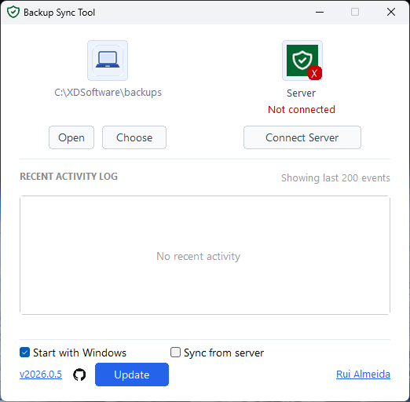
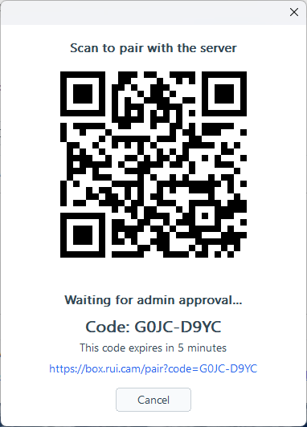

# Backup Sync Tool

Native Windows tray app that backs up one local folder to **S3** (MinIO). Pairing via Laravel supplies per-device credentials; uploads go direct to storage (no proxy).

## Three systems

| System | Host / repo |
| --- | --- |
| Pairing (control plane) | `https://backup.rui.cam` — Laravel `box-rui-cam` |
| Sync app (this) | Win7-compatible `backupsynctool.exe` |
| Object storage | `https://s3.rui.cam` — MinIO on Proxmox |

## Screenshots





## Features

- System tray — close hides; double-click restores
- Recursive folder watch + debounced uploads
- Parallel uploads (`parallel_uploads`, default 2, capped at 2)
- First-run baseline upload when no local manifest
- Optional download-from-server (`sync_remote_changes`)
- Admin pairing (QR/code) — server owns destination / S3 credentials
- DPAPI-encrypted secrets (S3 secret, device token)
- S3 PutObject + persistent multipart
- Recent Activity + sync footer progress
- GitHub auto-update, enabled by default

## Requirements

- Windows 7 SP1 x64 or newer
- Pairing API default `https://backup.rui.cam` + S3 endpoint from approve (`https://s3.rui.cam`)

## Install

Download `backupsynctool.exe` from [Releases](https://github.com/ruibeard/backup-sync-tool/releases/latest). Place `backupsynctool.json` next to the exe.

## Use

1. Set **backup folder** (or use detected `C:\XDSoftware\backups` when present).
2. **Pair** — QR / code; admin approves on `backup.rui.cam`.
3. Sync starts after pairing (no Save button). Old WebDAV configs must **re-pair** for S3.
4. **Reconnect** if storage returns an auth/credential failure.

## Build (developers)

Edit/commit on any machine. **Compile on Windows** (Proxmox Win10 VM 102 recommended):

```powershell
git fetch
git checkout s3-multipart-implementation
.\build-local.ps1
```

`build-local.ps1` always builds the **Windows 7-compatible** target `x86_64-win7-windows-msvc` (not a modern-only target). Details: [SPEC.md](SPEC.md) · VM notes: [proxmox/win10-build-vm.md](proxmox/win10-build-vm.md).

## Repo layout

| Path | Role |
| --- | --- |
| `src/` | Rust app (Win32 UI, sync, S3 transport, pairing) |
| `proxmox/` | Build-VM notes (compile host; not MinIO) |
| `docs/plans/` | Cutover / ops notes |
| `build-local.ps1` / `release.ps1` | Win7-compatible build & release |

## Security note

Desktop folder lock prevents accidental wrong-customer uploads. Hard isolation = one S3 bucket/key per device ([SPEC.md](SPEC.md#security)).
