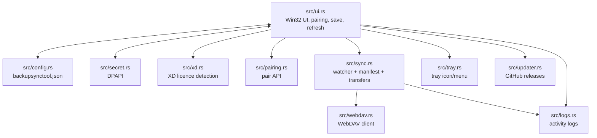
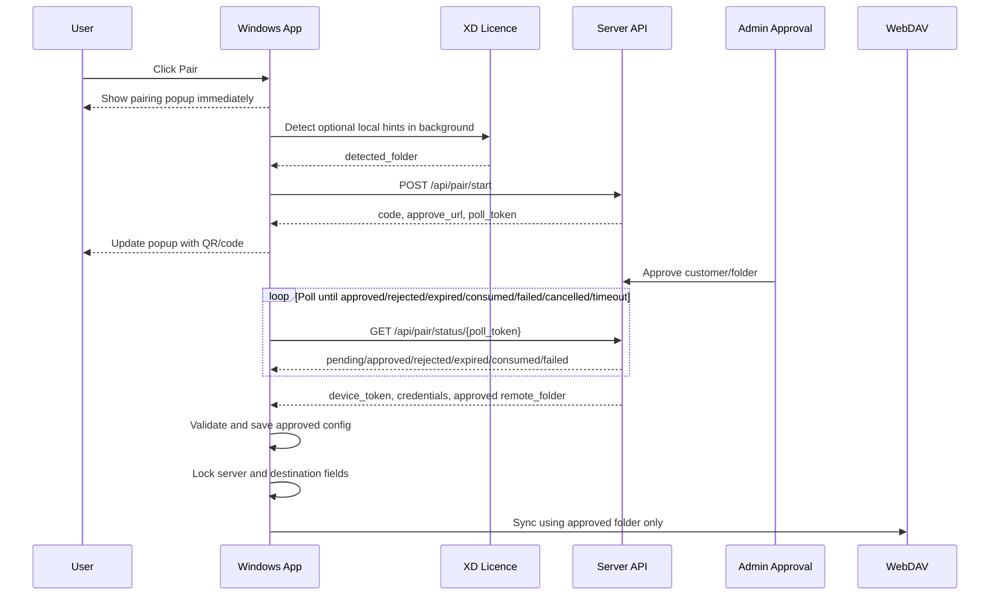

# Backup Sync Tool

Backup Sync Tool is a native Windows tray app that syncs one local backup folder to a WebDAV destination.

This README is the single project spec and handoff document. Keep current behavior here instead of adding separate feature/spec markdown files. `AGENTS.md` is reserved for agent/build instructions.

## Current Stack

- Rust 2021
- Raw Win32 UI through `windows-rs`
- Blocking HTTP/WebDAV through `ureq`
- Filesystem watching through `notify`
- JSON config through `serde` / `serde_json`
- Windows DPAPI for local secret encryption

Non-negotiables:

- No egui, nwg, webview, Electron, or async runtime.
- Config lives next to `backupsynctool.exe` as `backupsynctool.json`.
- The app must be launched from the repo root during local testing so it reads the root config.
- Closing the window hides it to tray; tray double-click reopens it.
- After code changes, build release, copy the exe to repo root, and relaunch from repo root.

## Features

- Native Windows tray app.
- Watches one local folder recursively.
- Local folder row includes quick actions to choose the folder and open it in Windows Explorer.
- Uploads new and changed files to WebDAV.
- Streams uploads from disk.
- Bounded parallel uploads with `parallel_uploads`.
- Optional remote-to-local sync polling.
- Local and remote manifest tracking with `.backupsynctool-manifest.json`.
- Pairing flow with server-approved customer folder.
- Destination folder lock after pairing.
- WebDAV auth failure pauses sync and asks the user/admin to pair again.
- DPAPI protection for device token and WebDAV password.
- Start with Windows support.
- Compact Recent Activity feed.
- Sync progress in the main window and tray tooltip.
- Silent GitHub release check on startup.

## Project Layout

| Path | Purpose |
| --- | --- |
| `src/main.rs` | Entry point, module wiring, window/message loop startup |
| `src/ui.rs` | Main Win32 UI, pairing UX, config locking, event handlers |
| `src/config.rs` | Load/save `backupsynctool.json` next to the exe |
| `src/secret.rs` | DPAPI encrypt/decrypt helpers |
| `src/webdav.rs` | Blocking WebDAV HTTP client |
| `src/sync.rs` | File watcher, manifest logic, upload/download sync engine |
| `src/tray.rs` | System tray icon and context menu |
| `src/updater.rs` | GitHub release check, download, swap, restart |
| `src/pairing.rs` | Pair start/status API client |
| `src/xd.rs` | XD local folder/licence detection |
| `src/logs.rs` | Local log file append/open support |
| `build.rs` | Embeds icons and manifest into the exe |
| `assets/` | App, tray, update, and sync icons |

## Architecture



## Configuration

Example `backupsynctool.json`:

```json
{
  "watch_folder": "C:\\XDSoftware\\backups",
  "webdav_url": "https://example.com/webdav/XD-BACKUPS",
  "username": "user",
  "password_enc": "...",
  "remote_folder": "XDPT.59655-Palmeira-Minimercado",
  "pair_api_base": "https://box.rui.cam",
  "device_token_enc": "...",
  "credential_profile_id": 10,
  "credential_version": 1,
  "start_with_windows": true,
  "sync_remote_changes": false,
  "parallel_uploads": 10
}
```

Important fields:

| Field | Meaning |
| --- | --- |
| `watch_folder` | Local folder watched recursively |
| `webdav_url` | Server/WebDAV root URL |
| `username` | WebDAV username |
| `password_enc` | DPAPI-encrypted WebDAV password |
| `remote_folder` | Approved server-owned customer folder after pairing |
| `pair_api_base` | Pairing/credential API base, default `https://box.rui.cam` |
| `device_token_enc` | DPAPI-encrypted device token; presence means paired |
| `credential_profile_id` | Optional server credential profile id |
| `credential_version` | Optional server credential version |
| `start_with_windows` | Defaults to `true` |
| `sync_remote_changes` | Enables remote manifest polling/downloads |
| `parallel_uploads` | Upload worker count, defaults to `10` |

Secrets must never be written as plaintext.

## XD Detection

XD detection is optional. If XD is not present, pairing still works and the server/admin chooses the customer.

Relevant local paths:

```text
C:\XDSoftware\backups
C:\XDSoftware\cfg\xd.lic
C:\XDSoftware\cfg\xd.pem
```

Current app behavior:

- `src/xd.rs` performs native Rust detection; it does not use PowerShell or XD DLL reflection.
- It reads `C:\XDSoftware\cfg\xd.lic` as JSON.
- It reads `C:\XDSoftware\cfg\xd.pem` as the RSA public key.
- It decrypts the `Number` and `ClientComercialName` fields with the same raw RSA block algorithm used by the diagnostic `license-inspector.exe --remote-folder` helper.
- It builds the detected folder as `Number` + `-` + slugified commercial name.

Detected values:

| Rust helper | Source | Example |
| --- | --- | --- |
| `default_watch_folder()` | Existing `C:\XDSoftware\backups` directory | `C:\XDSoftware\backups` |
| `detect_customer_hint().customer` | Decrypted `ClientComercialName` | `Palmeira Minimercado` |
| `detect_customer_hint().folder` | Decrypted `Number` + slugified decrypted `ClientComercialName` | `XDPT.59655-Palmeira-Minimercado` |

Before pairing, the app may prefill an empty destination field from XD detection. That value is only a hint. Pairing must not trust the editable destination textbox.

## Pairing And Folder Lock

Pairing lets the server approve the final customer folder and return credentials.



Pair start request:

```json
{
  "machine_name": "RECEPTION-PC",
  "windows_user": "office",
  "app_version": "2026.0.3",
  "detected_folder": "XDPT.59655-Palmeira-Minimercado"
}
```

Rules:

- `detected_folder` is a hint only.
- It comes from XD licence detection in `src/xd.rs`.
- It must not come from the editable destination textbox.
- If XD detection fails, the field is omitted.
- The approved `remote_folder` must come back from the server.
- Pair polling handles exact terminal statuses: `approved`, `rejected`, `expired`, `consumed`, and `failed`.

Approved response shape:

```json
{
  "status": "approved",
  "device_token": "...",
  "webdav_url": "https://example.com/webdav/XD-BACKUPS",
  "username": "...",
  "password": "...",
  "remote_folder": "XDPT.59655-Palmeira-Minimercado",
  "credential_profile_id": 10,
  "credential_version": 1
}
```

The app rejects approved pairing if:

- `device_token` is missing or empty.
- `webdav_url` is missing or does not start with `https://`.
- `username` is missing or empty.
- `password` is missing or empty.
- `remote_folder` is missing.
- `remote_folder` is empty.
- `remote_folder` is `/` or `\`.
- `remote_folder` starts with `/` or `\`.
- `remote_folder` contains `/` or `\`.
- `remote_folder` contains `..`.
- `remote_folder` contains ASCII control characters.

Once paired:

- `device_token_enc` is present.
- Server URL, username, password, and destination folder become read-only.
- Destination browse is hidden/disabled.
- `Save` preserves the stored approved folder even if UI text changes.
- Background XD detection cannot overwrite the approved folder.
- Remote picker navigation cannot change the approved folder.

The only supported way to change customer folder is to re-pair through the server.

## Sync Behavior

The sync engine watches `watch_folder` recursively using `notify`.

Main behavior:

- Startup loads local manifest from `.backupsynctool-manifest.json`.
- Startup fetches remote manifest from WebDAV.
- When `sync_remote_changes` is enabled, startup and remote polling also scan the approved WebDAV folder with `PROPFIND` so files that exist on the server but are missing from the manifest can still be downloaded.
- If there is no local manifest and `sync_remote_changes` is enabled, existing server files are downloaded as the first baseline before the app writes a new manifest.
- Local creates/modifies are queued and uploaded after a short debounce.
- Uploads are bounded by `parallel_uploads`.
- Manifest is uploaded after batches.
- Optional remote-to-local sync polls remote state every 60 seconds.
- Manifest file itself is ignored by scanning and event handling.

Remote URL construction:

```text
webdav_url / remote_folder / relative_file_path
```

Example:

```text
webdav_url:     https://example.com/webdav/XD-BACKUPS
remote_folder: XDPT.59655-Palmeira-Minimercado
relative path: 2026/backup.zip
upload URL:    https://example.com/webdav/XD-BACKUPS/XDPT.59655-Palmeira-Minimercado/2026/backup.zip
```

The sync engine must always use the stored approved `remote_folder` for paired devices.

## Credential Failure

Credential refresh is not part of the active desktop protocol.

On WebDAV `401` or `403`:

- Automatic sync is paused.
- A local activity/log message says the credentials are invalid.
- The UI asks the user/admin to pair again.
- The app does not call `/api/device/credential-refresh/*`.

## UI Behavior

The UI is raw Win32. Controls are direct children of the main window; do not add panel child windows for owner-drawn controls.

Implemented behavior:

- Closing hides to tray.
- Tray double-click reopens.
- Tray menu can open app/logs or exit.
- Pair button opens the pairing popup immediately, then the background pairing worker adds the QR/code after `/api/pair/start` responds.
- While pairing is pending, the server status shows an amber dot, `Waiting for approval`, and the Pair button changes to `Waiting...`.
- The pairing QR window starts in a preparing state, then shows the approval code, expiry text, waiting-for-admin message, QR code, approval link, and a Cancel button.
- Pairing approval saves the returned device token, WebDAV credentials, and approved folder automatically. The user does not need to click Save to complete pairing.
- Save is for local settings such as the local backup folder, startup preference, and remote-download preference; it is hidden while pairing is pending.
- UPDATE button is hidden until a newer GitHub release is found.
- Server credentials are not editable in the UI; `backupsynctool.json` is the source for stored WebDAV settings.
- Server status keeps the connected/paired/offline indicator; hovering it shows the configured server URL and approved destination folder.
- Destination folder is server-owned. Before pairing, the UI may show the XD-detected customer name/licence slug as a hint, but Laravel approval returns the final folder.
- Before approval the folder label is `Destination folder`; after approval it is `Approved folder`.
- Password field has show/hide behavior.
- Recent Activity displays compact sync/log messages such as `Uploading backup.zip`, `Uploaded backup.zip`, and `Downloaded backup.zip`.
- Sync progress is shown in the window and tray tooltip.
- The remote-to-local checkbox is labeled `Download from server` and maps to `sync_remote_changes`; this is a label-only wording choice and does not remove the existing behavior.

Visible pairing states:

| State | Status text | Pair button | Folder label |
| --- | --- | --- | --- |
| Unpaired | `Not paired` / connection status | `Pair` | `Destination folder` |
| Pairing | `Waiting for approval` | `Waiting...` | `Destination folder` |
| Paired | `Paired` / `All synced` | `Pair` | `Approved folder` |
| Credential failure | `Pair again required` | `Pair again` | `Approved folder` |

Visual rules:

- Window background: `#F0F0F0`
- Card background: `#F8F8F8`
- Card border: `#DEDEDE`
- Labels: `#333333`, Segoe UI 12pt
- Section headers: `#888888`, Segoe UI 10pt SemiBold, all caps
- Blue action buttons: `#2B4FA3` with white text
- Grey buttons: `#E8E8E8` with `#333333` text

## Auto Update And Release

On startup the app checks:

```text
https://api.github.com/repos/ruibeard/backup-sync-tool/releases/latest
```

If a newer version is available:

- UPDATE button appears.
- User-triggered update downloads the release exe.
- A batch swapper replaces the running exe and restarts the app.

Release flow:

1. For local build/test cycles, use `.\build-local.ps1`.
2. For an actual public release, prefer `.\release.ps1`.
3. `release.ps1` bumps the patch version in `Cargo.toml`, builds release, copies `target\release\backupsynctool.exe` to repo-root `backupsynctool.exe`, commits, creates a new `vX.Y.Z` tag, pushes `main`, pushes the tag, and verifies the remote tag exists.
4. Do not move or force-push an existing release tag during normal releases. Only use `git tag -f` / `git push --force` when explicitly repairing a bad tag or bad release.

## Build

From repo root:

```powershell
Stop-Process -Name "backupsynctool" -Force -ErrorAction SilentlyContinue
$env:PATH += ";$env:USERPROFILE\.cargo\bin"
cargo build --release
Copy-Item "target\release\backupsynctool.exe" "backupsynctool.exe" -Force
Start-Process "backupsynctool.exe"
```

Always launch from the repo root so the app finds `backupsynctool.json` next to the exe.

## Security Boundary

Desktop folder locking prevents normal users from accidentally selecting the wrong customer folder. It is not hard tenant isolation against a modified client if WebDAV credentials can write to a broad shared root.

Hard isolation requires server-issued customer-scoped WebDAV credentials where each credential can only access its approved customer folder.

## Future-Agent Checklist

Before changing pairing, sync, config, or credential handling:

- Check whether the device is paired using `device_token_enc`.
- Do not trust editable UI fields for server-owned values.
- Do not allow `Save` to overwrite paired `remote_folder`.
- Do not reintroduce credential refresh unless the protocol changes again.
- Keep DPAPI encryption for token/password.
- Keep sync URLs rooted at stored `webdav_url` + stored `remote_folder`.
- Rebuild release, copy exe to root, relaunch from root after code changes.
