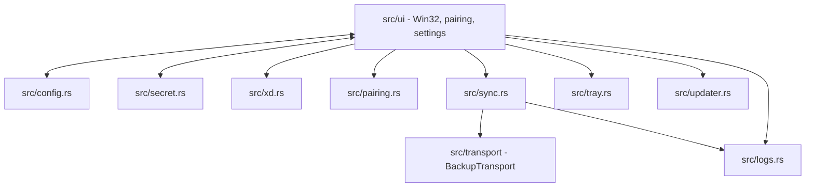
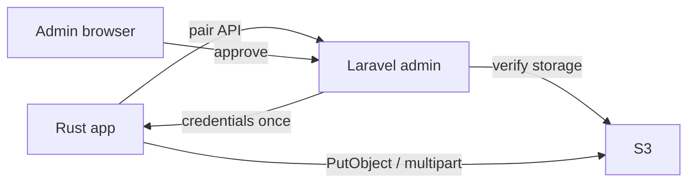
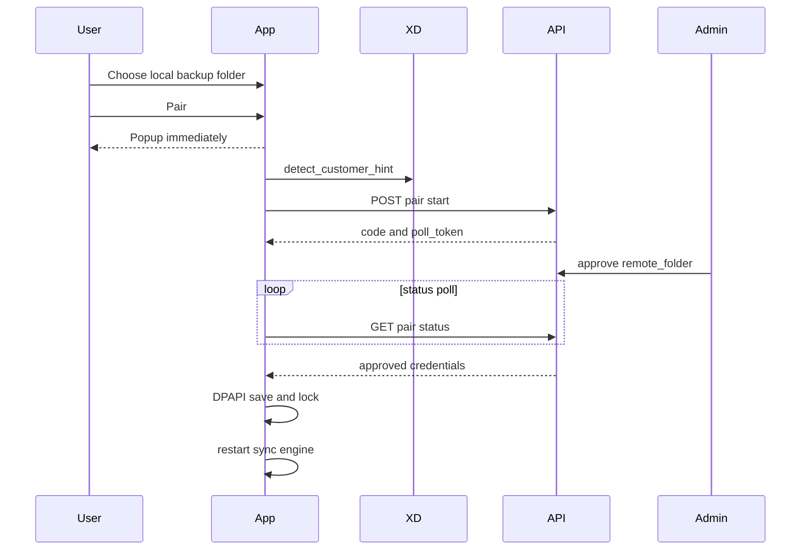

# Backup Sync Tool — Technical Spec

Engineer / LLM reference. User-facing summary: [README.md](README.md).

## Stack

| Layer | Choice |
| --- | --- |
| Language | Rust 2021 |
| UI | Raw Win32 (`windows-rs`) — no egui/webview/Electron/async runtime |
| HTTP | Blocking `ureq` (S3 SigV4 + pairing API) |
| Watcher | `notify` |
| Config | `serde_json` → `backupsynctool.json` next to exe |
| Secrets | Windows DPAPI (`src/secret.rs`) |

## Architecture



## Module map

| Path | Purpose |
| --- | --- |
| `src/main.rs` | Entry, message loop |
| `src/ui/` | Window, commands, pairing UX, activity list |
| `src/config.rs` | Load/save config (`transport` must be `s3`; legacy WebDAV fields ignored) |
| `src/sync.rs` | Watcher, manifests, upload/download engine via `BackupTransport` |
| `src/transport/` | Object-safe S3 storage backend (`s3.rs`) |
| `src/pairing.rs` | Pair start/status client (S3 approved payloads only) |
| `src/xd.rs` | Native XD licence detection |
| `src/tray.rs` | Tray icon/menu |
| `src/updater.rs` | GitHub release check/swap |
| `src/logs.rs` | `logs/YYYY-MM-DD.log` |

UI layout reference: `mockups.html`.

## System roles



Laravel = control plane only. Never proxies backup bytes.

## Three systems

| System | Repo / host | Job |
| --- | --- | --- |
| Control plane | Laravel `box-rui-cam` → `https://backup.rui.cam` | Pair API, approve, issue S3 creds |
| Sync app | this repo | Win32 client; Win7-compatible exe |
| Object storage | Proxmox MinIO CT 101 → `https://s3.rui.cam` | PutObject / multipart bytes |

Do not conflate pairing URL (`backup.rui.cam`) with S3 endpoint (`s3.rui.cam`). Legacy `box.rui.cam` was the old WebDAV pairing host.

## Cutover checklist (current)

Verified from Mac (2026-07-12):

| Check | Status |
| --- | --- |
| `https://s3.rui.cam/minio/health/live` | 200, Let's Encrypt |
| `https://backup.rui.cam/api/pair/start` | 200, `approve_url` on backup.rui.cam |
| Proxmox `/root/s3-minio-creds.txt` | present |
| Win10 VM 102 | QEMU running; build via guest agent / desktop |

Still operator / Forge (not verifiable from client repo alone):

- [ ] Forge `.env` has `S3_BACKUP_PUBLIC_ENDPOINT=https://s3.rui.cam` (not backup.rui.cam) + admin keys from Proxmox creds file
- [ ] Forge deploys branch with S3 pairing (`s3-multipart-implementation`)
- [ ] Approve a test pair → client receives `s3_endpoint: https://s3.rui.cam`
- [ ] Win10 VM 102: `git pull` + `.\build-local.ps1` (Win7 target)
- [ ] Re-pair any device still on old WebDAV config; smoke upload

## Configuration

`backupsynctool.json` beside `backupsynctool.exe`. Secrets never plaintext.
Missing / empty / `webdav` `transport` is rejected — pair again for S3.

### Legacy WebDAV fields

`webdav_url` / `username` / `password_enc` may still appear in old JSON and deserialize, but sync ignores them.

### S3 (PutObject + persistent multipart)

```json
{
  "transport": "s3",
  "watch_folder": "C:\\XDSoftware\\backups",
  "pair_api_base": "https://backup.rui.cam",
  "device_token_enc": "...",
  "remote_folder": "XDPT.59655-Palmeira-Minimercado",
  "s3_endpoint": "https://s3.rui.cam",
  "s3_region": "us-east-1",
  "s3_bucket": "device-bucket",
  "s3_access_key": "...",
  "s3_secret_enc": "...",
  "s3_path_style": true,
  "s3_prefix": "",
  "s3_part_size_mib": 32,
  "parallel_uploads": 2,
  "start_with_windows": true,
  "sync_remote_changes": false
}
```

| Field | Notes |
| --- | --- |
| `watch_folder` | Watched recursively |
| `transport` | must be `s3` |
| `remote_folder` | Server-approved single segment; locked after pair. S3 customer metadata only |
| `device_token_enc` | Present ⇒ paired |
| `s3_bucket` | Per-device bucket from pairing (do not assume a shared bucket) |
| `s3_prefix` | Optional; may be empty. Object key is `{prefix}/{relative}` when set, else `{relative}` |
| `s3_secret_enc` / `password_enc` / `device_token_enc` | DPAPI; entropy remains `webdavsync-v1` |
| `s3_part_size_mib` | Default `32`; clamped 16–64 MiB. Files ≤ this use `PutObject`; larger use multipart (part size may grow to keep ≤ 10 000 parts; non-final parts ≥ 5 MiB) |
| `server_approved_at` | Local timestamp written when pairing approval is accepted |
| `sync_remote_changes` | UI: **Download from server**; enables remote poll + download baseline |
| `auto_update` | UI: **Auto-update**; default `true`; installs newer GitHub releases automatically |
| `parallel_uploads` | Default `2`; capped at 2 |

`Config::Default` must be explicit (serde ignores `default` fns on derived `Default`).

## XD detection (`src/xd.rs`)

Optional. Pairing works without XD.

Paths:

```text
C:\XDSoftware\backups          → default watch_folder if dir exists
C:\XDSoftware\cfg\xd.lic       → JSON licence
C:\XDSoftware\cfg\xd.pem       → RSA public key
```

Native flow: parse `xd.lic` → decrypt `Number`, `ClientComercialName` (raw RSA blocks, same algorithm as `license-inspector`) → folder = `{Number}-{slug(commercial_name)}`.

| Output | Example |
| --- | --- |
| `default_watch_folder()` | `C:\XDSoftware\backups` |
| `detect_customer_hint().customer` | `Palmeira Minimercado` |
| `detect_customer_hint().folder` | `XDPT.59655-Palmeira-Minimercado` |

Rules:

- `detected_folder` in pair start = hint from XD only — **not** editable destination field.
- Prefill destination before pair only; Laravel approval is authoritative.
- `license-inspector.exe` — diagnostic / test parity only; app does not spawn it in normal flow.

## Pairing API

Base: `{pair_api_base}` (default `https://backup.rui.cam`).

### Flow



### `POST /api/pair/start`

```json
{
  "machine_name": "RECEPTION-PC",
  "windows_user": "office",
  "app_version": "2026.0.3",
  "detected_folder": "XDPT.59655-Palmeira-Minimercado",
  "supported_transports": ["s3"]
}
```

Clients must advertise `supported_transports: ["s3"]`. Non-S3 approvals are rejected.

Response: `code`, `approve_url`, `poll_token`, `poll_interval_ms`.

### `GET /api/pair/status/{poll_token}`

| Status | App behavior |
| --- | --- |
| `pending` | Keep polling |
| `approved` | Validate, save, start sync, stop poll |
| `rejected` | Stop, notify user |
| `expired` | Stop, notify user |
| `consumed` | Stop, re-pair message |
| `failed` | Stop, notify user |

Do not use `denied`.

### Approved payload (once)

WebDAV approvals are no longer accepted. Historical shape (ignored by current client):

```json
{
  "status": "approved",
  "device_token": "...",
  "transport": "webdav",
  "webdav_url": "https://...",
  "username": "...",
  "password": "...",
  "remote_folder": "XDPT.59655-Palmeira-Minimercado",
  "credential_profile_id": 10,
  "credential_version": 1
}
```

S3:

```json
{
  "status": "approved",
  "device_token": "...",
  "transport": "s3",
  "s3_endpoint": "https://s3.rui.cam",
  "s3_region": "us-east-1",
  "s3_bucket": "device-550e8400-e29b-41d4-a716-446655440000",
  "s3_access_key": "...",
  "s3_secret_key": "...",
  "s3_path_style": true,
  "s3_prefix": "",
  "remote_folder": "XDPT.59655-Palmeira-Minimercado",
  "credential_profile_id": 123,
  "credential_version": 1
}
```

Initial S3 isolation is one bucket and one access key per device. `s3_prefix` is optional/provider-neutral and may be empty. Do not infer a shared bucket or build a customer/device prefix from `remote_folder`. For S3, `remote_folder` is customer metadata only.

Reject if: missing/empty token; invalid `remote_folder`; non-S3 approval; S3 endpoint not `https://`; missing bucket/access/secret (`s3_prefix` may be empty).

Valid `remote_folder`: one segment; trimmed non-empty; not `/` `\`; no `/` `\` `..`; no ASCII controls; must not start with `/` `\`.

### After pair

- `device_token_enc` set ⇒ paired.
- Server URL, user, password, destination read-only; no destination browse.
- `persist_settings` must not overwrite `remote_folder` from UI.
- Only change folder/credentials: **re-pair**.
- Pairing cannot start unless `watch_folder` is a real local directory; the user must Choose a folder first when XD default backup folder is missing.
- **`restart_sync_engine()`** required after approval (`src/ui/utils.rs`) — save alone is insufficient.

Pair popup opens before `/api/pair/start` returns; QR updates when response arrives.

## Sync engine

### Start triggers (`restart_sync_engine`)

Requires a valid `watch_folder`, `remote_folder`, and transport credentials:

- S3: `s3_endpoint`, `s3_bucket`, `s3_access_key`, `s3_secret`; `s3_prefix` is optional

| Trigger | Location |
| --- | --- |
| Launch (configured) | `src/ui/create.rs` `on_create` |
| Pair approved | `src/ui/messages.rs` `on_app_pair_result` |
| Choose folder / toggles | `src/ui/commands.rs` `persist_settings*` |

Empty or missing watch folder before pair → `xd::default_watch_folder()` when available; otherwise Connect/Reconnect is disabled until the user chooses a valid backup folder with Choose. Approval handling still re-checks the folder defensively; if it is no longer valid, local pairing is not saved and sync does not start.

### Transport (`src/transport`)

`sync.rs` uses `Arc<dyn BackupTransport>` only — no S3-specific calls outside `src/transport/`.

```rust
pub trait BackupTransport: Send + Sync {
    fn test_connection(&self) -> Result<(), TransportError>;
    fn upload_file(&self, relative_path: &str, local_path: &Path, metadata: &FileMetadata) -> Result<(), TransportError>;
    fn download_file(&self, relative_path: &str, destination_path: &Path) -> Result<FileMetadata, TransportError>;
    fn list_files(&self) -> Result<Vec<RemoteFile>, TransportError>;
    fn head_file(&self, relative_path: &str) -> Result<Option<ObjectHead>, TransportError>;
    fn delete_file(&self, relative_path: &str) -> Result<(), TransportError>;
}
```

- `S3Transport`: SigV4 `PutObject` / multipart (`CreateMultipartUpload`, `UploadPart`, paginated `ListParts`, `CompleteMultipartUpload`, `AbortMultipartUpload`) / `HeadObject` / `ListObjectsV2` / `GetObject` / `DeleteObject`. Source mtime as `x-amz-meta-backup-mtime`. Multipart also stores `x-amz-meta-backup-upload-token`. Files ≤ `s3_part_size_mib` use `PutObject` (size-verified `HeadObject`). Larger files use sequential multipart with resume state under `%LOCALAPPDATA%\BackupSyncTool\multipart-v1\` (SHA-256 storage-identity filename; atomic Windows 7-safe writes; state version 2). Completed parts store local SHA-256; resume retains only local∩server matching ETag/size/digest (never server-only hybrids). Part buffers capped at 64 MiB; objects above `64 MiB × 10 000` are rejected. Same-object uploads are serialized in-process. After Complete + token/size HEAD, state enters `Verified` and is kept until the source identity (size + mtime nanoseconds) changes — a later unchanged upload rechecks HEAD and returns success without reupload. Re-stat after verify: if the source changed, return `TransportError::SourceChanged` so the local manifest is not updated. `NoSuchUpload` recovers via token HEAD. Retry only transient idempotent part/control errors (not auth/local/XML). Parse HTTP-200 embedded Complete errors. ListParts pagination requires a strictly increasing marker and a page cap.
- Downloads never load whole files into a `Vec<u8>`; stream to a temp `.part` file and rename.

### Startup (`sync_startup`)

1. Load local manifest `{watch_folder}/.backupsynctool-manifest.json` (empty if missing).
2. Log file count.

| Local manifest file | `sync_remote_changes` off | on |
| --- | --- | --- |
| Missing | Upload **all** local files | Download remote manifest baseline if entries exist |
| Present | List + upload changed/missing on server | + download when remote differs |

### Ongoing

- Watcher: recursive `notify`, debounce, ignore local/remote manifest filenames.
- Local manifest: updated **only after successful upload** per path.
- Remote manifest: rewritten from **server listing** (`list_files`), never full local scan; the small remote manifest also acts as the lightweight server-change marker.
  - S3 remote name: `.backupsynctool-remote-manifest.json`
- Skip upload (manifest exists): local unchanged since last success **and** server file size matches (`remote_file_states` / listing).
- `heal_missing_uploads`: every 24h re-upload missing/size-mismatch on server.
- Remote marker poll when `sync_remote_changes` true: every 10s for 5 minutes after startup or upload activity, then every 30s while idle. Marker changes trigger downloads without a recursive scan.
- Full remote scan fallback when `sync_remote_changes` true: every 60s `list_files` to discover files added outside the app or without a fresh remote manifest.
- Manual **Refresh** button: paired server action that performs one immediate remote pull check, including listing, and downloads server changes without enabling continuous remote polling.

Upload locations:

```text
S3:     s3://{bucket}/{relative_path}                  (empty s3_prefix)
S3:     s3://{bucket}/{s3_prefix}/{relative_path}      (optional prefix)
```

### Storage errors

| Condition | Behavior |
| --- | --- |
| S3 `InvalidAccessKeyId` / `SignatureDoesNotMatch` / expired / policy `AccessDenied` | Auth failed → same reconnect UX |
| Missing object (404 / `NotFound`) | Not an auth failure |
| Other | Log; do not treat missing objects as auth failure |

No `/api/device/credential-refresh/*` — re-pair only.

S3 auth: SigV4 (`hmac` + `sha2` + `hex`), blocking `ureq`.

## UI rules

- Raw Win32; owner-draw children must be **direct** children of main window (`WM_DRAWITEM`).
- No **Save** — auto-save folder choice + checkboxes.
- Main layout (**Stitch mockup — connection + sync band**): white connection card — PC node with icon above the local path, with compact **Open** and **Choose** actions below; S3 server node with icon above the storage host and approved remote folder below, plus paired server actions **Refresh** and **Reconnect Server**. If no valid local folder exists, hide Open, Refresh, and Connect/Reconnect and show one **Choose folder** action. No centre column. The divider sits below the bridge action row. Server icon carries a green ✓ or red ✕ badge.
- **Sync band** (below connection card, when paired): **All synced** + 100% green bar when idle; **Syncing** + blue bar with **%** and **ETA** when uploading/downloading; **Checking…** when scanning.
- **Recent activity**: header **RECENT ACTIVITY LOG** + **Showing last 200 events**; info rows show clock time on the right; file rows show **Done** or **%**.
- Bridge icons: baked PNGs at **120×120** (3× logical tile) in `assets/bridge-pc.png` and `assets/bridge-server.png`; SVG sources kept in `assets/svg-backups/`. Downscaled to 40×40 at draw time with HALFTONE.
- **Typography** (Segoe UI, pixel heights): 13px body; 12px captions/paths/activity status; 12px semibold bridge names and sync head; 11px bold section headings; 13px buttons; 12px links. Muted text `#666666`.
- Notices: `notify_user()` / `notify_user_status()` — no `MessageBox` except manual update Yes/No when auto-update is off.
- Labels: backup folder path shown in bridge (Choose to change); if no XD/default folder exists, show "Choose backup folder" instead of pretending `C:\XDSoftware\backups` exists. Connect/Reconnect stays disabled until that path is a real directory. The paired server node shows the approved destination folder, with host, approval time, and credential metadata in the tooltip.
- Colours: window `#F0F0F0`, bridge card `#FFFFFF`, accent `#2B4FA3` → `COLORREF(0x00A34F2B)`.

## Logs

Always on: `logs/YYYY-MM-DD.log` next to exe.

## Auto-update

```text
GET https://api.github.com/repos/ruibeard/backup-sync-tool/releases/latest
```

Download release asset → swap exe → restart.

`auto_update` defaults to `true`. When enabled, a detected newer release starts the download/install flow immediately and restarts the app. When disabled, the app shows the manual **Update** action and asks for Yes/No before installing.

Asset selection:

- Prefer `backupsynctool.exe`.
- Public releases must publish one Windows 7-compatible `backupsynctool.exe`.
- Do not publish separate Win7 and Win10 exe assets unless the updater is changed to handle channels intentionally.

## Build & launch

**Target always:** `x86_64-win7-windows-msvc` via `.\build-local.ps1` (nightly + `rust-src` + `-Z build-std`). Do not ship a modern-Windows-only target.

Workflow:

1. Edit + commit on Mac/dev machine (this repo).
2. On Proxmox **Win10 build VM 102** (`win10-build`): `git pull` / checkout `s3-multipart-implementation`, then from repo root:

```powershell
.\build-local.ps1    # Win7-compatible x64 exe → root backupsynctool.exe → launch
.\release.ps1        # version bump, same Win7 target, tag, push (public release only)
```

Never run from `target/debug` or `target/release` for local testing.

Win10 VM notes: `proxmox/win10-build-vm.md`. Win7 **test** VM is separate (VM 100) — compile on 102, validate on 100.

Build details:

- Script copies exe to root `backupsynctool.exe`.
- Import verification must reject known Windows 8+ startup imports: `GetSystemTimePreciseAsFileTime`, `WaitOnAddress`, `WakeByAddressAll`, `WakeByAddressSingle`, `ProcessPrng`.
- Final validation must include a launch test on Windows 7 SP1 x64, not only Windows 10/11.

## Security

Desktop lock = accident prevention, not anti-tamper. Hard isolation = one S3 bucket and access key per device.

## Out of scope (desktop protocol)

- Laravel upload proxy
- Credential refresh API
- SSE/WebSocket credential delivery
- Client encryption beyond HTTPS + DPAPI at rest

## Implementation checklist (changes)

- [ ] Paired? → `device_token_enc`
- [ ] After pair → `restart_sync_engine()`
- [ ] Do not trust UI for `remote_folder` / credentials
- [ ] Auth failure only for real S3 credential/policy failures — not missing objects
- [ ] Local manifest: success upload only
- [ ] Remote manifest: from server listing only
- [ ] First run, no manifest, download off → upload all local files
- [ ] Missing / webdav `transport` → refuse sync; require re-pair for S3
- [ ] Downloads stream to `.part` then rename (no whole-file `Vec` buffering)
- [ ] S3: PutObject for files ≤ `s3_part_size_mib`; persistent multipart above that with token HEAD verify
