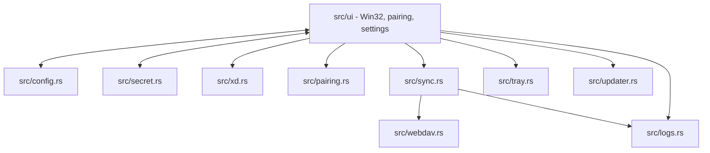
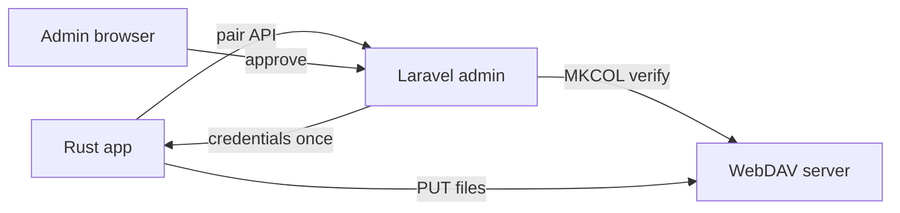
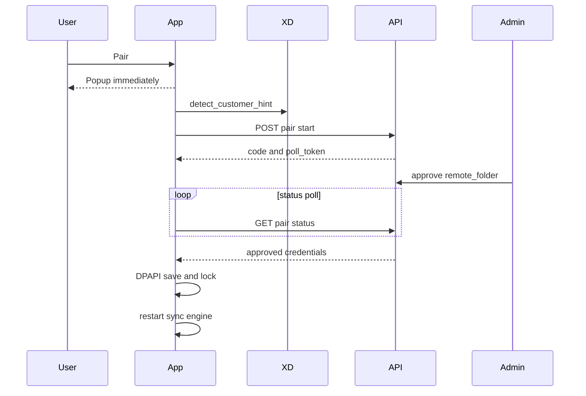

# Backup Sync Tool — Technical Spec

Engineer / LLM reference. User-facing summary: [README.md](README.md).

## Stack

| Layer | Choice |
| --- | --- |
| Language | Rust 2021 |
| UI | Raw Win32 (`windows-rs`) — no egui/webview/Electron/async runtime |
| HTTP | Blocking `ureq` (WebDAV + pairing API) |
| Watcher | `notify` |
| Config | `serde_json` → `backupsynctool.json` next to exe |
| Secrets | Windows DPAPI (`src/secret.rs`) |

## Architecture



## Module map

| Path | Purpose |
| --- | --- |
| `src/main.rs` | Entry, message loop |
| `src/ui/` | Window, commands, pairing UX, activity list |
| `src/config.rs` | Load/save config |
| `src/sync.rs` | Watcher, manifests, upload/download engine |
| `src/webdav.rs` | PROPFIND, MKCOL, PUT, GET |
| `src/pairing.rs` | Pair start/status client |
| `src/xd.rs` | Native XD licence detection |
| `src/tray.rs` | Tray icon/menu |
| `src/updater.rs` | GitHub release check/swap |
| `src/logs.rs` | `logs/YYYY-MM-DD.log` |

UI layout reference: `mockups.html`.

## System roles



Laravel = control plane only. Never proxies backup bytes.

## Configuration

`backupsynctool.json` beside `backupsynctool.exe`. Secrets never plaintext.

```json
{
  "watch_folder": "C:\\XDSoftware\\backups",
  "webdav_url": "https://example.com/webdav/XD-BACKUPS",
  "username": "user",
  "password_enc": "...",
  "remote_folder": "XDPT.59655-Palmeira-Minimercado",
  "pair_api_base": "https://box.rui.cam",
  "device_token_enc": "...",
  "server_approved_at": "2026-06-17 00:42",
  "credential_profile_id": 10,
  "credential_version": 1,
  "start_with_windows": true,
  "sync_remote_changes": false,
  "parallel_uploads": 10
}
```

| Field | Notes |
| --- | --- |
| `watch_folder` | Watched recursively |
| `remote_folder` | Server-approved single segment; locked after pair |
| `device_token_enc` | Present ⇒ paired |
| `server_approved_at` | Local timestamp written when pairing approval is accepted |
| `sync_remote_changes` | UI: **Download from server**; enables remote poll + download baseline |
| `parallel_uploads` | Default `10` |

`Config::Default` must be explicit (serde ignores `default` fns on derived `Default`).

## XD detection (`src/xd.rs`)

Optional. Pairing works without XD.

Paths:

```text
C:\XDSoftware\backups          → default watch_folder if dir exists
C:\XDSoftware\cfg\xd.lic       → JSON licence
C:\XDSoftware\cfg\xd.pem       → RSA public key
```

Native flow: parse `xd.lic` → decrypt `Number`, `ClientComercialName` (raw RSA blocks, same algorithm as `license-inspector`) → folder = `{Number}-{slug(commercial_name)}`.

| Output | Example |
| --- | --- |
| `default_watch_folder()` | `C:\XDSoftware\backups` |
| `detect_customer_hint().customer` | `Palmeira Minimercado` |
| `detect_customer_hint().folder` | `XDPT.59655-Palmeira-Minimercado` |

Rules:

- `detected_folder` in pair start = hint from XD only — **not** editable destination field.
- Prefill destination before pair only; Laravel approval is authoritative.
- `license-inspector.exe` — diagnostic / test parity only; app does not spawn it in normal flow.

## Pairing API

Base: `{pair_api_base}` (default `https://box.rui.cam`).

### Flow



### `POST /api/pair/start`

```json
{
  "machine_name": "RECEPTION-PC",
  "windows_user": "office",
  "app_version": "2026.0.3",
  "detected_folder": "XDPT.59655-Palmeira-Minimercado"
}
```

Response: `code`, `approve_url`, `poll_token`, `poll_interval_ms`.

### `GET /api/pair/status/{poll_token}`

| Status | App behavior |
| --- | --- |
| `pending` | Keep polling |
| `approved` | Validate, save, start sync, stop poll |
| `rejected` | Stop, notify user |
| `expired` | Stop, notify user |
| `consumed` | Stop, re-pair message |
| `failed` | Stop, notify user |

Do not use `denied`.

### Approved payload (once)

```json
{
  "status": "approved",
  "device_token": "...",
  "webdav_url": "https://...",
  "username": "...",
  "password": "...",
  "remote_folder": "XDPT.59655-Palmeira-Minimercado",
  "credential_profile_id": 10,
  "credential_version": 1
}
```

Reject if: missing/empty token; `webdav_url` not `https://`; missing user/pass; invalid `remote_folder`.

Valid `remote_folder`: one segment; trimmed non-empty; not `/` `\`; no `/` `\` `..`; no ASCII controls; must not start with `/` `\`.

### After pair

- `device_token_enc` set ⇒ paired.
- Server URL, user, password, destination read-only; no destination browse.
- `persist_settings` must not overwrite `remote_folder` from UI.
- Only change folder/credentials: **re-pair**.
- **`restart_sync_engine()`** required after approval (`src/ui/utils.rs`) — save alone is insufficient.

Pair popup opens before `/api/pair/start` returns; QR updates when response arrives.

## Sync engine

### Start triggers (`restart_sync_engine`)

Requires: `watch_folder`, `webdav_url`, username, password, `remote_folder`.

| Trigger | Location |
| --- | --- |
| Launch (configured) | `src/ui/create.rs` `on_create` |
| Pair approved | `src/ui/messages.rs` `on_app_pair_result` |
| Browse folder / toggles | `src/ui/commands.rs` `persist_settings*` |

Empty or missing watch folder at pair → `xd::default_watch_folder()` when available; otherwise prompt the user to choose the backup folder. If the user cancels, local pairing is not saved and sync does not start.

### Startup (`sync_startup`)

1. Load local manifest `{watch_folder}/.backupsynctool-manifest.json` (empty if missing).
2. Log file count.

| Local manifest file | `sync_remote_changes` off | on |
| --- | --- | --- |
| Missing | Upload **all** local files | Download remote manifest baseline if entries exist |
| Present | PROPFIND + upload changed/missing on server | + download when remote differs |

### Ongoing

- Watcher: recursive `notify`, debounce, ignore `.backupsynctool-manifest.json`.
- Local manifest: updated **only after successful PUT** per path.
- Remote manifest: rewritten from **PROPFIND** (`save_remote_manifest_from_server`), never full local scan.
- Skip upload (manifest exists): local unchanged since last success **and** server file size matches (`remote_file_states`).
- `heal_missing_uploads`: every 24h re-upload missing/size-mismatch on server.
- Remote poll: 60s when `sync_remote_changes` true.

Upload URL:

```text
{webdav_url}/{remote_folder}/{relative_path}
```

### WebDAV errors

| HTTP | Behavior |
| --- | --- |
| **401** | `WebDavError::AuthFailed` → pause sync, **Reconnect required**, pair again |
| **403** on MKCOL | Treat as exists (with 405); continue to PUT |
| Other | Log; do not show “Credentials Invalid” for Storage Box MKCOL 403 |

No `/api/device/credential-refresh/*` — re-pair only.

Auth header: `Basic base64(username:password)`.

## UI rules

- Raw Win32; owner-draw children must be **direct** children of main window (`WM_DRAWITEM`).
- No **Save** — auto-save browse + checkboxes.
- Main layout (**Stitch mockup — connection + sync band**): white connection card — PC node with icon above the local path, with compact **Open** and **Browse** actions below; WebDAV node with icon above the approved destination folder and host/live status below, plus **Reconnect Server**. No centre column. The divider sits below the bridge action row. Server icon carries a green ✓ or red ✕ badge.
- **Sync band** (below connection card, when paired): **All synced** + 100% green bar when idle; **Syncing** + blue bar with **%** and **ETA** when uploading/downloading; **Checking…** when scanning.
- **Recent activity**: header **RECENT ACTIVITY LOG** + **Showing last 200 events**; info rows show clock time on the right; file rows show **Done** or **%**.
- Bridge icons: baked PNGs at **120×120** (3× logical tile) in `assets/bridge-pc.png` and `assets/bridge-server.png`; SVG sources kept in `assets/svg-backups/`. Downscaled to 40×40 at draw time with HALFTONE.
- **Typography** (Segoe UI, pixel heights): 13px body; 12px captions/paths/activity status; 12px semibold bridge names and sync head; 11px bold section headings; 13px buttons; 12px links. Muted text `#666666`.
- Notices: `notify_user()` / `notify_user_status()` — no `MessageBox` except update Yes/No.
- Labels: backup folder path shown in bridge (Browse to change); if no XD/default folder exists, show a choose-folder prompt instead of pretending `C:\XDSoftware\backups` exists. The paired server node shows the approved destination folder, with host, approval time, and credential metadata in the tooltip.
- Colours: window `#F0F0F0`, bridge card `#FFFFFF`, accent `#2B4FA3` → `COLORREF(0x00A34F2B)`.

## Logs

Always on: `logs/YYYY-MM-DD.log` next to exe.

## Auto-update

```text
GET https://api.github.com/repos/ruibeard/backup-sync-tool/releases/latest
```

Download release asset → swap exe → restart.

Asset selection:

- Prefer `backupsynctool.exe`.
- Public releases must publish one Windows 7-compatible `backupsynctool.exe`.
- Do not publish separate Win7 and Win10 exe assets unless the updater is changed to handle channels intentionally.

## Build & launch

From repo root (config beside root `backupsynctool.exe`):

```powershell
.\build-local.ps1    # dev cycle
.\build-win7.ps1     # Windows 7-compatible x64 build
.\release.ps1        # version bump, tag, push
```

Never run from `target/debug` or `target/release` for local testing.

Windows 7 support is handled by making the single public x64 exe use the Windows 7-compatible build target:

- Build target: `x86_64-win7-windows-msvc`.
- Build command is in `build-win7.ps1`; it uses nightly Rust with `rust-src` and `-Z build-std=std,panic_abort`.
- The script copies the built exe to root `backupsynctool.exe` for local launch.
- `release.ps1` uses the same compatible target and publishes the normal root `backupsynctool.exe`.
- Import verification must reject known Windows 8+ startup imports: `GetSystemTimePreciseAsFileTime`, `WaitOnAddress`, `WakeByAddressAll`, `WakeByAddressSingle`, `ProcessPrng`.
- Final validation must include a launch test on Windows 7 SP1 x64, not only Windows 10/11.

## Security

Desktop lock = accident prevention, not anti-tamper. Hard isolation = per-customer scoped WebDAV credentials on server.

## Out of scope (desktop protocol)

- Laravel upload proxy
- Credential refresh API
- SSE/WebSocket credential delivery
- Client encryption beyond HTTPS + DPAPI at rest

## Implementation checklist (changes)

- [ ] Paired? → `device_token_enc`
- [ ] After pair → `restart_sync_engine()`
- [ ] Do not trust UI for `remote_folder` / credentials
- [ ] 401 only → auth failure
- [ ] Local manifest: success PUT only
- [ ] Remote manifest: PROPFIND only
- [ ] First run, no manifest, download off → upload all local files
